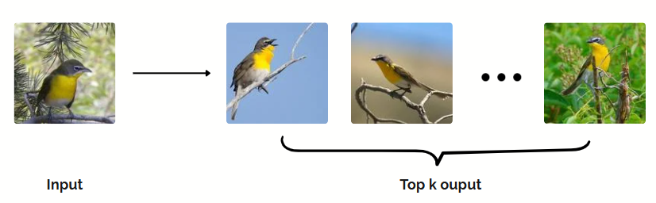
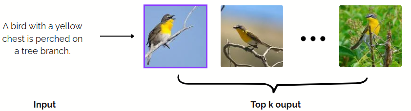

# Image Retrieval trên CUB-200 (image-retrieval)

Đây là repository chứa mã nguồn, dữ liệu mẫu, notebook và các trọng số để thực nghiệm hệ thống Truy xuất Ảnh (Image Retrieval) trên tập dữ liệu CUB-200-2011. Mục tiêu của dự án là hỗ trợ:

- Tìm ảnh tương đồng (image-to-image retrieval).
- Tìm ảnh theo mô tả văn bản (text-to-image retrieval) thông qua mô hình CLIP hoặc biến thể.
- Finetune và đánh giá nhiều backbone: ResNet, ViT, ConvNeXt, DINOv2, SigLIP, v.v.
- Demo giao diện người dùng nhẹ bằng Streamlit.


_Ví dụ minh hoạ truy xuất ảnh — ảnh query bên trái và top-k kết quả bên phải._


_Ví dụ minh hoạ truy xuất văn bản — ảnh query bên trái và top-k kết quả bên phải._

Nội dung chính của repo
- `app.py`: Streamlit demo client (UI) cho phép gọi API tìm kiếm và hiển thị kết quả.
- `test.py`: script mẫu để kiểm tra endpoint `/search` (thay giá trị `API_URL` bằng URL ngrok của bạn).
- `cubdataset.py`: Data loader cho tập CUB-200-2011, trả về (image, label, caption).
- `model/`: các mô-đun mô hình (`clip.py`, `resnet.py`, `vit.py`).
- `notebooks/`: bộ notebook cho fine-tune và thử nghiệm nhiều kiến trúc.
- `weights/`: thư mục chứa các file trọng số đã huấn luyện (ví dụ: `best_resnet50_cub.pth`, adapter safetensors...).

Quick Start
1. Tạo môi trường ảo và cài đặt phụ thuộc (Windows):

```powershell
python -m venv venv
.\venv\Scripts\activate
python -m pip install --upgrade pip
# Cài PyTorch theo hướng dẫn chính thức (https://pytorch.org) phù hợp với GPU/CUDA của bạn
# Sau đó cài các thư viện Python còn lại:
pip install pandas pillow scikit-learn scikit-image tqdm timm transformers ftfy tokenizers safetensors streamlit requests matplotlib
```

2. Chuẩn bị dữ liệu CUB-200-2011
- Tải dataset CUB_200_2011 từ trang chính thức và giải nén sao cho có cấu trúc giống `dataset/CUB/CUB_200_2011/` (các file `images.txt`, `image_class_labels.txt`, `train_test_split.txt`, và thư mục `images/` phải tồn tại).
- Chuẩn bị caption/text: đặt các file `.txt` chứa caption tương ứng với mỗi ảnh theo cấu trúc `dataset/CUB/captions/<class>/<image_name>.txt`.
- Hoặc sử dụng trực tiếp data của tôi sau khi đã dùng Qwen2.5-2B-VL để tạo caption: [CUB-caption](https://www.kaggle.com/datasets/nmpogg/cub-caption)

3. Trọng số (weights)
- Thư mục `weights/` chứa một số checkpoint đã huấn luyện sẵn. Đặt các file `.pth` hoặc `.safetensors` ở đây nếu bạn muốn load model đã huấn luyện.
- Các adapter (ví dụ `clip_adapter`, `vit_adapter`, `siglip_adapter`, ...) đã được lưu trong các subfolder tương ứng.

4. Chạy demo UI (Streamlit)
- `app.py` là client Streamlit: nó gửi yêu cầu tới backend (endpoint `/search`) và hiển thị ảnh trả về.
- Cách chạy:

```bash
streamlit run app.py
```

- Lưu ý: `app.py` yêu cầu backend server có route `POST /search` đang chạy và có thể truy cập (ví dụ bằng ngrok). Mở `app.py` trên trình duyệt, dán URL ngrok của server vào ô input ở thanh bên.

5. Chạy test client
- Chỉnh sửa `API_URL` trong [test.py](test.py) (gán URL ngrok + `/search`) rồi chạy:

```bash
python test.py
```

API backend (kỳ vọng)
- Endpoint: `POST /search`
- Form-data / body fields:
	- `model_type`: tên mô hình (ví dụ: `resnet`, `vit`, `clip`, `convnext`, `siglip`, ...)
	- `query_type`: `image` hoặc `text`
	- `top_k`: số lượng kết quả trả về (int)
	- `file`: (nếu `query_type=image`) file ảnh gửi qua form-data
	- `text_query`: (nếu `query_type=text`) chuỗi mô tả
- Response (ví dụ):

```json
{
	"model_used": "resnet",
	"top_k_results": [
		{"image_path": "001.Black_footed_Albatross/001.jpg", "similarity": 0.9123},
		...
	]
}
```

Ghi chú về `app.py`
- `app.py` hiển thị kết quả bằng cách ghép `dataset/CUB/CUB_200_2011/images` với `image_path` trả về từ server. Nếu bạn lưu ảnh ở vị trí khác, chỉnh lại đường dẫn trong `app.py` hoặc đảm bảo `image_path` trả về tương ứng.

Chi tiết dữ liệu & loader
- `CUBDataset` trong `cubdataset.py` kỳ vọng `root_dir` trỏ tới thư mục chứa `images/` và các file `.txt` chuẩn của CUB. File caption (nếu tồn tại) được đọc từ `dataset/CUB/captions` (hoặc `text_dir` nếu truyền vào constructor).

Model & Notebook
- Các mô-đun mô hình chính nằm trong `model/`:
	- `model/clip.py`: cài đặt CLIP-like, bao gồm image/text encoder và loss contrastive.
	- `model/resnet.py`, `model/vit.py`: cài đặt các backbone tham khảo.
- Thư mục `notebooks/` chứa nhiều notebook cho fine-tune và kiểm thử (ví dụ: `notebooks/clip-base/ir-finetune-clip.ipynb`, `notebooks/cnn-base/ir-finetune-resnet.ipynb`, `notebooks/vit-base/ir-finetune-vit.ipynb`, ...). Mở notebook tương ứng để chạy huấn luyện/đánh giá.

Mẹo vận hành
- GPU được khuyến nghị cho fine-tune/đánh giá tốc độ cao.
- Chọn phiên bản PyTorch phù hợp với CUDA của bạn tại https://pytorch.org trước khi cài các package khác.
- Đối với inference lớn, cân nhắc feature caching (lưu embeddings cho toàn bộ dataset để tăng tốc tìm kiếm nearest neighbors).

Gợi ý mở rộng
- Thêm endpoint để trả kết quả có đường dẫn tuyệt đối hoặc URL (thay vì đường dẫn tương đối) để client không cần map thủ công.
- Thêm script build-index (FAISS / Annoy) cho tốc độ truy xuất nhanh.

Đóng góp
- Mọi PR, issue, và đề xuất đều hoan nghênh.

Liên hệ
- Nếu cần hỗ trợ cụ thể với dataset/huấn luyện/triển khai, cho tôi biết chi tiết bước bạn muốn thực hiện.

---

File hữu ích nhanh:
- [app.py](app.py) - Streamlit client
- [test.py](test.py) - Script kiểm thử endpoint
- [cubdataset.py](cubdataset.py) - Dataset loader
- `weights/` - chứa checkpoint & adapter

